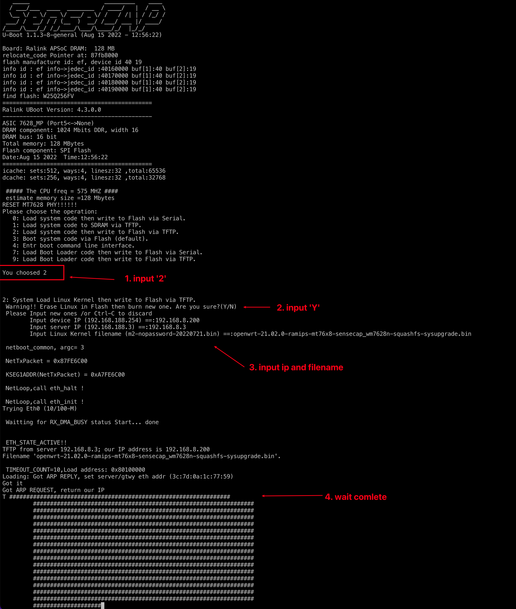
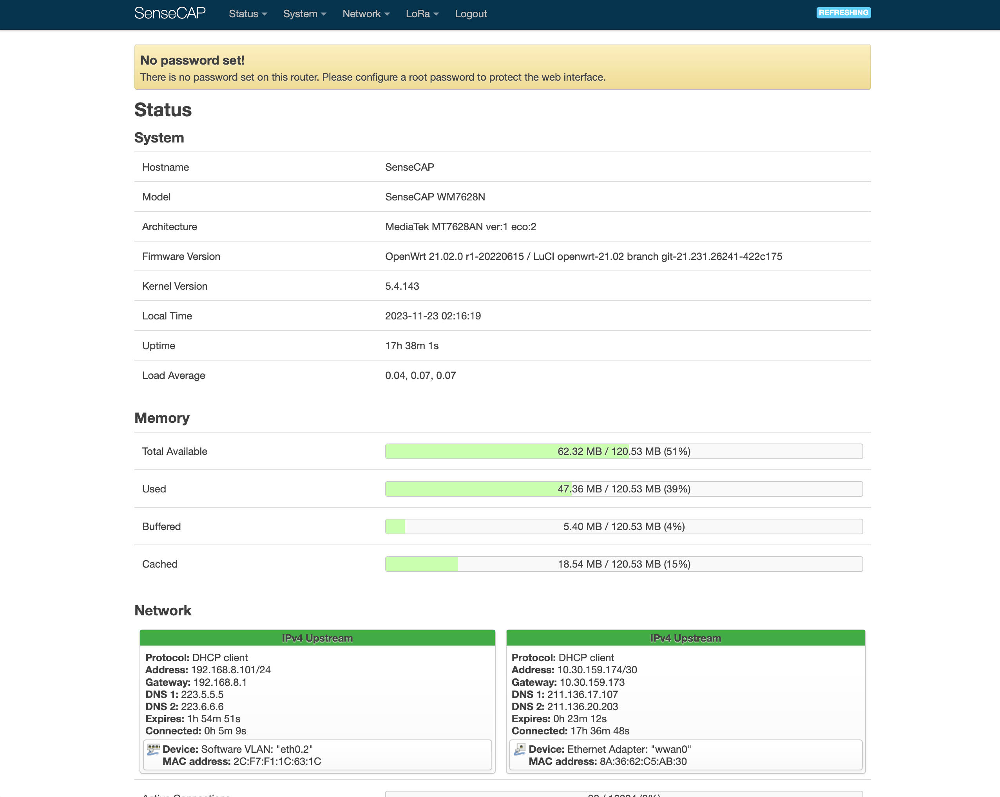

OpenWrt Project is a Linux operating system targeting embedded devices. Instead
of trying to create a single, static firmware, OpenWrt provides a fully
writable filesystem with package management. This frees you from the
application selection and configuration provided by the vendor and allows you
to customize the device through the use of packages to suit any application.
For developers, OpenWrt is the framework to build an application without having
to build a complete firmware around it; for users this means the ability for
full customization, to use the device in ways never envisioned.

Sunshine!

## Development

To build your own firmware you need a GNU/Linux, BSD or MacOSX system (case
sensitive filesystem required). Cygwin is unsupported because of the lack of a
case sensitive file system.

### Requirements

You need the following tools to compile OpenWrt, the package names vary between
distributions. A complete list with distribution specific packages is found in
the [Build System Setup](https://openwrt.org/docs/guide-developer/build-system/install-buildsystem)
documentation.

```
gcc binutils bzip2 flex python3 perl make find grep diff unzip gawk getopt
subversion libz-dev libc-dev rsync which
```

### Quickstart

1. Run `./scripts/feeds update -a` to obtain all the latest package definitions
   defined in feeds.conf / feeds.conf.default

2. Run `./scripts/feeds install -a` to install symlinks for all obtained
   packages into package/feeds/

3. Run `cp diffconfig-sensecap-general .config` to use SenseCAP  diff file, and run `make defconfig` to expand full config.

4. Run `make menuconfig` to select your SenseCAP Hardware information.

- SenseCAP Hardware->Have 4G ( Whether it contains 4G Hardware)
- SenseCAP Hardware->Have GPS ( Whether it contains GPS Hardware)
- SenseCAP Hardware->REGION (select your default REGION)

1. Run `make` to build your firmware. This will download all sources, build the
   cross-compile toolchain and then cross-compile the GNU/Linux kernel & all chosen
   applications for your target system.

### Related Repositories

The main repository uses multiple sub-repositories to manage packages of
different categories. All packages are installed via the OpenWrt package
manager called `opkg`. If you're looking to develop the web interface or port
packages to OpenWrt, please find the fitting repository below.

* [LuCI Web Interface](https://github.com/openwrt/luci): Modern and modular
  interface to control the device via a web browser.

* [OpenWrt Packages](https://github.com/openwrt/packages): Community repository
  of ported packages.

* [OpenWrt Routing](https://github.com/openwrt/routing): Packages specifically
  focused on (mesh) routing.

## Support Information

For a list of supported devices see the [OpenWrt Hardware Database](https://openwrt.org/supported_devices)

### Documentation

* [Quick Start Guide](https://openwrt.org/docs/guide-quick-start/start)
* [User Guide](https://openwrt.org/docs/guide-user/start)
* [Developer Documentation](https://openwrt.org/docs/guide-developer/start)
* [Technical Reference](https://openwrt.org/docs/techref/start)

### Support Community

* [Forum](https://forum.openwrt.org): For usage, projects, discussions and hardware advise.
* [Support Chat](https://webchat.oftc.net/#openwrt): Channel `#openwrt` on **oftc.net**.

### Developer Community

* [Bug Reports](https://bugs.openwrt.org): Report bugs in OpenWrt
* [Dev Mailing List](https://lists.openwrt.org/mailman/listinfo/openwrt-devel): Send patches
* [Dev Chat](https://webchat.oftc.net/#openwrt-devel): Channel `#openwrt-devel` on **oftc.net**.

## License

OpenWrt is licensed under GPL-2.0


## How to Flash

### Step1 Get Firmware

You can compile the project or download the bin file from the release.
The firmware path:
```
<prj>/bin/targets/ramips/mt76x8/openwrt-21.02.0-ramips-mt76x8-sensecap_wm7628n-squashfs-sysupgrade.bin
```
### Step2 Setup TFTP Server in your computer

Install the TFTP server tool on your computer and put the firmware into the corresponding directory.

### Step3 Setup SenseCAP Device 

1. Use a Type-c cable to connect the device to the computer, and use a network cable to place the device and the computer in the same LAN.
2. Connect to the device using the serial port (baud rate 57600)
3. Restart the device. When the device enters uboot, select command 2 to enter the system update.
4. Enter device ip, where the device ip network segment must be the network segment of your own network; enter server ip, which is the IP of the computer, and enter the name of the firmware to be burned (the file suffix must be included)
5. Wait for the firmware update to complete.

  


## How to use

### Console

1. Use a Type-c cable to connect the device to the computer.
2. Connect to the device using the serial port (baud rate 57600).
3. Press Enter, enter username 'root', no password.

### SSH 

1. Place the device and computer in the same LAN.
2. Use SSH tool to connect, port is 22, username is root, no password.


### Device AP  & Luci

1. The device will automatically open an AP hotspot, name "SenseCAP_XXXX".
2. Use your phone or computer to connect to the hotspot, no password.
3. Enter "192.168.168.1" in the browser to enter the LuCI interface.
4. Enter username 'root', no password.  


  